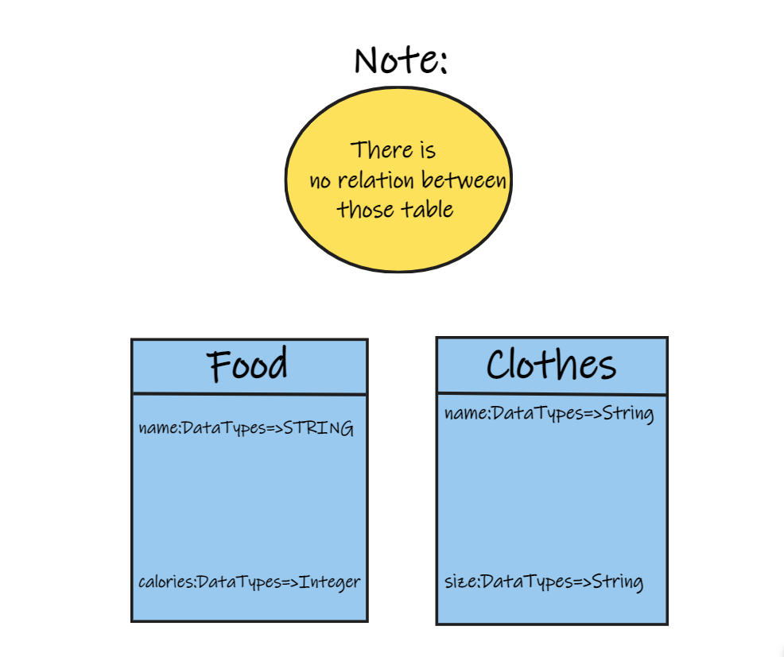

# api-server
Build a REST API using Express.

## Link for PR
[Click Here](https://github.com/ebnanzhran/api-server/pull/1)
[Pull request](https://github.com/ebnanzhran/api-server/pull/1)

## Link for Heroku
Please type /food or /clothe

[Click Here](https://bnan-api-server.herokuapp.com/)

### To check please type /food or /clothe
[Heroku](https://bnan-api-server.herokuapp.com/)

## UML Diagram
